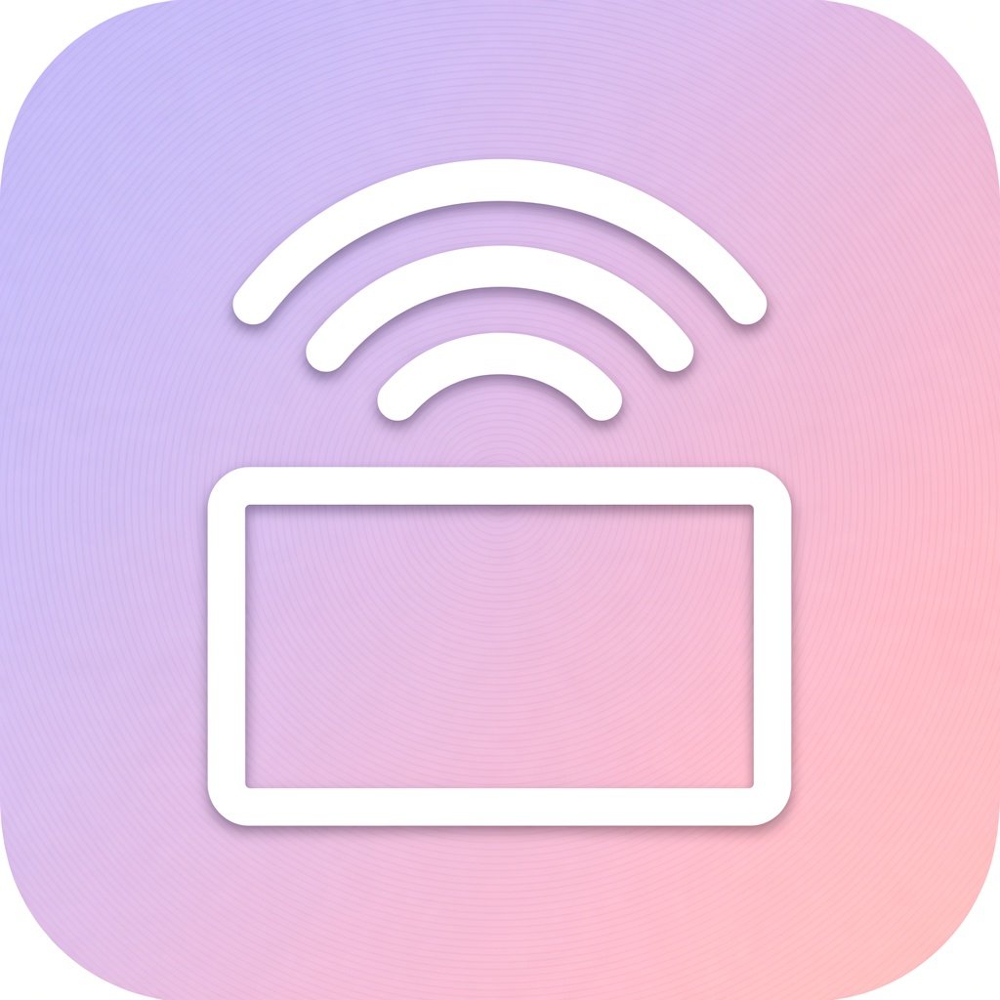

# Beam

<p align="center">
  
</p>

Android browser that casts playable streams to an Apple TV.

It opens a WebView, watches for media URLs (HLS, mp4, some audio), and sends them with AirPlay `play_url` via [pyatv](https://pyatv.dev/). This is **not** FairPlay screen mirroring. DRM sites (Netflix, many YouTube players, blob URLs, …) usually don’t expose anything castable.

Phone and TV need the same Wi‑Fi. Guest networks that isolate clients will fail.

---

## Build

- JDK 17  
- Python 3.12 available for [Chaquopy](https://chaquo.com/chaquopy/) (Windows: `~/AppData/Local/Programs/Python/Python312/python.exe`, otherwise `python` on `PATH`)

```powershell
.\gradlew.bat :app:assembleRelease
```

APK: `app/build/outputs/apk/release/Beam-1.0.0.apk`

---

## Use

1. Open Beam → connection chip / cast button.  
2. Scan (or enter the TV IP) → pair with the PIN → Connect.  
3. Play a video in the browser. When a castable URL shows up, use the bottom bar → quality → Send.

Keep the cast notification / battery unrestricted if you lock the phone, or the session may drop.

Overflow menu: home, screen share, reload, desktop site, stop.  
UI language follows the system (German defaults, English when the device is English).

---

## Internals (brief)

| Bit | Role |
|-----|------|
| WebView sniff | Finds stream URLs |
| Local playlist server | Tiny HLS master when A/V need bundling |
| Chaquopy + pyatv | Pair / play / stop |
| `CastKeepAliveService` | Keeps networking alive with the screen off |

`app/src/main/python/pyatv_patch.py` tweaks modern tvOS `play_url` (stock legacy `/play` often 500s).

---

## Limits

- No DRM unlock, no FairPlay.  
- No direct URL on the page → nothing to cast.  
- Empty scan → try the TV IP manually (multicast issues).  
- Screen share is optional and heavier than URL cast.

---

## Trademark / affiliation

Beam is an independent project. **Not affiliated with Apple, Google, or any streaming service.**  
“AirPlay”, “Apple TV”, “Android”, and similar names are trademarks of their owners and are used here only to describe compatibility.

The app icon and in-app cast glyph are original Beam artwork (generic screen + signal arcs), not Apple’s AirPlay mark.

See [NOTICE](NOTICE) and [LICENSE](LICENSE) (MIT).
